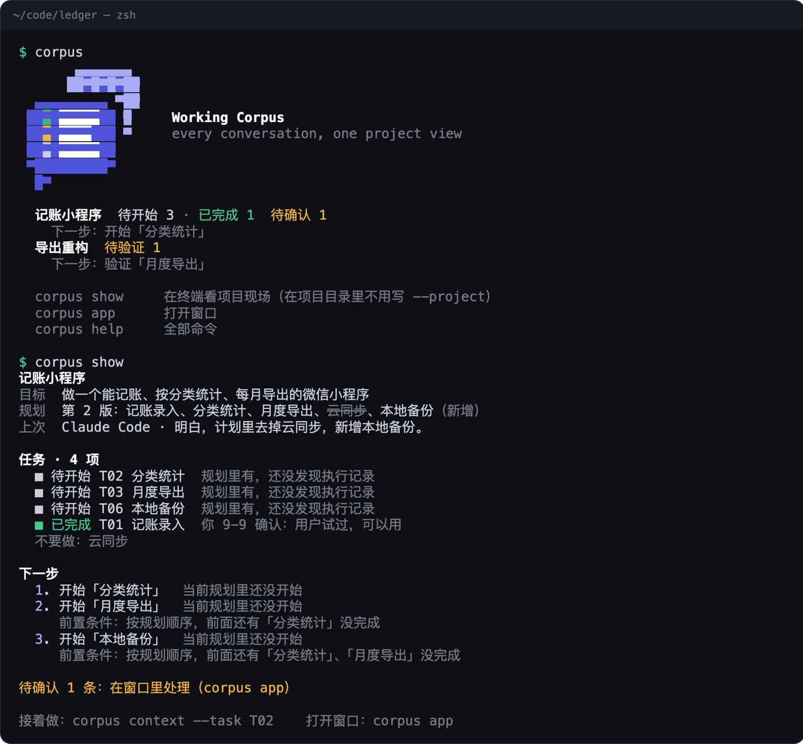

<p align="center">
  <picture>
    <source media="(prefers-color-scheme: dark)" srcset="docs/logo-dark.png">
    
  </picture>
</p>

# Working Corpus

**你在 Claude Code、Codex、VS Code 和网页 AI 之间来回切。Working Corpus 把这些对话整理成一页项目现场，每条结论都能点回原话。**

隔天回来，不用翻几段长对话，敲一个命令或打开一个窗口就知道：最初想做什么、后来改了什么、哪些真做完了、哪些只是 AI 说做完了、现在卡在哪、下一步做什么。换个工具接着干，把一段准确的背景带过去。

它是一个跑在你电脑上的**本地应用**：终端里用 `corpus` 命令，桌面上用一个独立窗口。数据都在本机。

<p align="center"></p>

<p align="center"></p>

<sub>两张图都是示例数据。窗口里那个任务，AI 两次说导出做好了，中间用户报告过文件打不开，Working Corpus 把它标成“待验证”，不算完成。</sub>

## 三分钟上手

需要 Node 22.18 或更新版本，不用构建，不用配置模型。

```
git clone https://github.com/Longado/working-corpus && cd working-corpus
npm install && npm link          # 装好全局命令 corpus

corpus demo                      # 用样本数据建两个示例项目
corpus                           # 终端里：所有项目的概况
corpus show                      # 终端里：一个项目的现场
corpus app                       # 桌面窗口：后台启动本地服务，用独立窗口打开
corpus stop                      # 停掉后台服务
```

macOS 上想要一个双击就能打开的应用：

```
npm run mac-app                  # 生成 dist/Working Corpus.app，带像素图标，拖进“应用程序”即可
```

## 用在自己的项目上

```
cp .env.example .env                                   # 填 DEEPSEEK_API_KEY
corpus project add "项目名" --dir /你的/代码目录 --goal "一句话目标"
corpus app                                             # 在窗口里点“同步”
```

之后在项目目录里直接敲 `corpus show` 看现场，`corpus context --task T03` 打印某个任务的续接背景，贴进任何 AI 工具接着干。

## 用 AI 做项目的人，每天都在问这四个问题

1. 我最初想做什么？后来改过哪些要求？
2. 哪些真的做完了，哪些只是 AI 说做完了？
3. 现在卡在哪，下一步该做什么？
4. 换一个会话或工具，怎样不用把整个项目重新解释一遍？

聊天记录里都有答案，只是散在不同工具的几十段对话里。Working Corpus 把它们读出来，整理成一页。

## 能做什么

| | |
|---|---|
| 读对话 | Claude Code、Codex（命令行和 VS Code 扩展都算）、VS Code 自带聊天，直接读本机文件，按代码目录自动归到项目；网页 AI 可以粘贴导入、从 Google Takeout 的 zip 导入，Gemini 还能装浏览器扩展一键加入、之后自动补新消息 |
| 项目现场 | 当前目标和规划版本、上次停在哪、需要你处理的、下一步、任务列表、最近的决定；顶部的语料带里每个方块是一条消息，颜色是它支撑的任务的状态 |
| 任务状态 | 跨工具的同一件事只算一个任务；AI 说完成只算待验证，你确认了才算完成；返工重开原任务，不新增 |
| 规划和决定 | 最初规划、当前规划、每次变更都留着；AI 提议你没确认的不进范围；被新决定推翻的标为“已被替代”；原文没说原因就写“未说明” |
| 下一步 | 最多三条，带完成标准、前置条件和依据；可以采纳、暂缓、驳回，取消的事项不再推荐 |
| 续接背景 | 目标、当前规划、这个任务的进展、相关决定、阻塞、前置条件，以及“不要做”的已取消事项；可复制、可导出 |
| 追溯和纠错 | 每条结论点开有原话；合并、拆分、改名、改状态、移到别的项目、移出归错的会话、从头重新整理；你改过的，自动整理不会悄悄覆盖；两段来源说法相反又分不出先后时，摆出来让你定；改过重发的消息，旧版本保留但不再参与判断 |

## 和别的记忆工具哪里不一样

- **给人看，不是塞给 AI。** claude-mem、ai-memory 把记忆写回给 AI，SpecStory 把对话存成档案。Working Corpus 给你一页扫一眼就懂的项目现场。
- **只认证据。** AI 说“做完了”“测试通过了”，只算待验证。每个状态都写明依据是你确认的、原文写明的，还是 AI 自述。
- **大模型只做一件事。** 它只负责把消息标成证据，并且必须引用原话。状态、数量、规划版本、下一步、前置条件都由代码按固定规则算出来，同样的记录永远得到同样的结果。
- **你说了算。** 你的修正优先；和新证据冲突时放进“待确认”，让你决定。

## 接到 AI 工具里

这些都是薄连接器，离开本地应用用不了。

| 连接器 | 做什么 | 说明 |
|---|---|---|
| Claude Code 插件 | 在对话里直接取项目现场和续接背景；会话结束时在后台同步 | `/plugin marketplace add Longado/working-corpus`，见 `docs/PLUGIN.md` |
| MCP 连接器 | 给 Codex、Cursor 等支持 MCP 的工具用 | 见 `docs/MCP.md` |
| Gemini 浏览器扩展 | 在 Gemini 对话页上点一下加入项目，之后自动补新消息 | 开发者模式加载 `extension/`，见 `docs/EXTENSION.md` |

## 它是怎么工作的

```
Claude Code 会话文件 ─┐
Codex 会话文件 ───────┤
VS Code 聊天记录 ─────┼─ 读取、过滤、去重、隐藏凭证 ─ 按目录归到项目
粘贴 · Takeout · 扩展 ┘                                   │
                                                          ▼
                        大模型：把新消息标成证据，每条必须引用原话（唯一的模型调用）
                                                          │
                                                          ▼
                代码：按规则折叠成任务状态、规划版本、决定、下一步；你的修正优先
                                                          │
                                                          ▼
                    终端 corpus · 桌面窗口 · 续接背景 · 连接器
```

完整规则见 `docs/contracts.md`。

## 数据和隐私

- 只读取你绑定的目录下的会话，别的目录一概不读。
- 数据都存在本机 `~/.working-corpus/`；本地服务只监听 127.0.0.1，只对浏览器扩展放行跨域，网站来源一律拒绝。
- 第一次整理前会说明发送什么内容，你同意后才把对话正文发给远程模型。读取时已把像密钥、令牌的内容换成“[已隐藏的凭证]”。
- 可以暂停采集（已有数据保留），也可以删除项目（相关记录一起清掉）。

## 现在的状态

需求文档 v0.2 的 P0、P1 和补充项全部完成。116 条测试；七个样本场景的真模型评估里，硬红线从没失败过；用 `deepseek-flash` 整理一个 74 条消息的真实项目约 2 分钟。评估记录在 `docs/EVAL.md`，样本少，只说明这几种场景没出错，不代表真实对话里的准确率。

还没用真实数据验证的：网页版 Gemini 的 Takeout 导出格式、浏览器扩展在登录后的真实页面上的表现、大模型在真实项目上的长期准确率。

已知限制：编排工具（比如 Orca）派给 worker 的指令会被当成你说的话；Codex 的工具报错、Claude Code 子 agent 的会话暂时不读；Codex 和 VS Code 自带聊天的消息编辑版本暂不处理。

## 开发

```
npm test                     # 单元测试，不调用模型
npm run typecheck
corpus eval                  # 用真模型跑样本，硬红线有一条没过就返回失败
```

| 文档 | 内容 |
|---|---|
| `docs/DEMO.md` | 演示脚本：终端和桌面窗口 |
| `docs/PLAN.md` | 开发计划和进度 |
| `docs/REQUIREMENTS-GAP.md` | 对照需求文档 v0.2 的完成情况 |
| `docs/contracts.md` | 模块之间的约定、状态规则 |
| `docs/EVAL.md` | 每次改提示词或换模型的评估记录 |
| `docs/FORM.md` | 形态研判：为什么是本地应用加连接器 |
| `docs/PLUGIN.md` · `docs/MCP.md` · `docs/EXTENSION.md` | 三个连接器 |
| `docs/HANDOFF.md` | 交接：现在到哪了、下一步 |
| `prompts/evidence.md` | 唯一的提示词，文件头有版本号 |
