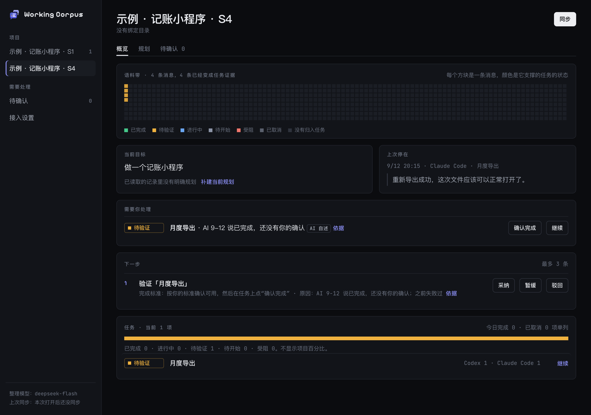

# Working Corpus

**你在 Claude Code、Codex 和网页 AI 之间来回切。Working Corpus 把这些对话整理成一页项目现场，每条结论都能点回原话。**

隔天回来，不用翻三段长对话，打开一页就知道：最初想做什么、后来改了什么、哪些真做完了、哪些只是 AI 说做完了、现在卡在哪、下一步做什么。换个工具接着干，点一下"继续"，把准确的背景带过去。



<sub>截图是示例数据：AI 两次说导出做好了，中间用户报告过文件打不开。Working Corpus 把它标成"待验证"，不算完成。</sub>

## 用 AI 做项目的人，每天都在问这四个问题

1. 我最初想做什么？后来改过哪些要求？
2. 哪些真的做完了，哪些只是 AI 说做完了？
3. 现在卡在哪，下一步该做什么？
4. 换一个会话或工具，怎样不用把整个项目重新解释一遍？

聊天记录里都有答案，只是散在不同工具的几十段对话里。Working Corpus 把它们读出来，整理成一页。

## 打开之后你看到的

| 区块 | 回答什么 |
|---|---|
| 当前目标和规划版本 | 现在做的是第几版计划，和最初比改了什么，改的原因是谁说的 |
| 上次停在 | 最近一次在哪个工具里做到哪一步 |
| 需要你处理 | 待验证和受阻的任务，受阻写清缺什么 |
| 下一步 | 最多三条，每条带完成标准和依据；可以采纳、暂缓、驳回 |
| 任务 | 按唯一任务计数，跨工具的同一件事只算一个；取消的单列 |
| 最近决定 | 采用了什么、否决了什么；原文没说原因就写"未说明" |
| 原文侧栏 | 点任何结论，右边显示它引用的原话、来源、时间 |
| 继续 | 生成一段续接背景：目标、当前规划、这个任务的进展、相关决定、阻塞，以及"不要做"的已取消事项 |

## 和别的记忆工具哪里不一样

- **给人看，不是塞给 AI。** claude-mem、ai-memory 把记忆写回给 AI，SpecStory 把对话存成档案。Working Corpus 给你一页能扫一眼就懂的项目现场。
- **只认证据。** AI 说"做完了""测试通过了"，只算待验证；你确认了才算完成。每个状态都写明依据是你确认的、原文写明的，还是 AI 自述。
- **大模型只做一件事。** 它只负责把消息标成证据，并且必须引用原话。任务状态、数量、规划版本、下一步都由代码按固定规则算出来，同样的记录永远得到同样的结果。
- **你说了算。** 你改过的状态、合并过的任务，下一轮自动整理不会悄悄覆盖；有冲突就放进"待确认"，让你决定。
- **跨工具。** Claude Code、Codex 的会话直接读本机文件，网页 AI 的对话粘贴导入。同一件事在三个工具里做过，只算一个任务。

## 三分钟试一下

需要 Node 22.18 或更新版本，不用构建，不用配置模型。

```
npm install
npm run corpus -- demo      # 用样本数据建两个示例项目
npm run corpus -- serve     # 打开 http://127.0.0.1:4173
```

## 用在自己的项目上

```
cp .env.example .env                                   # 填 DEEPSEEK_API_KEY
npm run corpus -- project add "项目名" --dir /你的/代码目录 --goal "一句话目标"
npm run corpus -- serve                               # 在页面上点"同步"
```

网页 AI 的对话在"接入设置"里粘贴导入，用"你：""Gemini："这样的开头区分发言者；只复制了一部分就勾上"只复制了一部分"，Working Corpus 不会拿缺失的前文下结论。

## 在 AI 工具里直接取

不想复制粘贴，就把 Working Corpus 接到 AI 工具上。它提供三个只读工具：列出项目、看项目现场、生成某个任务的续接上下文。在 Claude Code 里注册：

```
claude mcp add corpus -- node --no-warnings --env-file-if-exists=<仓库>/.env <仓库>/src/cli.ts mcp
```

之后在对话里说"先看一下 Working Corpus 里的项目现场，然后按续接上下文继续做 T03"就行。Codex 和 Cursor 的配置见 `docs/MCP.md`。

## 它是怎么工作的

```
Claude Code 会话文件 ─┐
Codex 会话文件 ───────┼─ 读取、过滤、去重、隐藏凭证 ─ 按目录归到项目
粘贴导入的网页对话 ───┘                                   │
                                                          ▼
                        大模型：把新消息标成证据，每条必须引用原话（唯一的模型调用）
                                                          │
                                                          ▼
                代码：按规则折叠成任务状态、规划版本、决定、下一步；你的修正优先
                                                          │
                                                          ▼
                              本地网页 · 命令行 · 续接上下文
```

状态规则的要点：AI 称完成只到待验证；完成后又报错就重开原任务，不新增任务；只有 AI 提出、你没回应的规划不进入范围；取消的事项退出下一步，续接上下文里列在"不要做"。完整规则见 `docs/contracts.md`。

## 数据和隐私

- 只读取你绑定的目录下的会话，别的目录一概不读。
- 数据都存在本机 `~/.working-corpus/corpus.db`；页面服务只监听 127.0.0.1。
- 第一次整理前会说明发送什么内容，你同意后才把对话正文发给远程模型。读取时已把像密钥、令牌的内容换成"[已隐藏的凭证]"。
- 可以暂停采集（已有数据保留），也可以删除项目（相关记录一起清掉）。

## 现在的状态

MVP。已经能用，也有明确的边界：

- 六个样本场景的评估，硬红线从没失败过；用 `deepseek-flash` 整理一个 74 条消息的真实项目约 2 分钟。评估记录在 `docs/EVAL.md`。样本少，只说明这几种场景没出错，不代表真实对话里的准确率。
- 暂不支持：Cursor、Gemini 浏览器扩展、后台自动同步、团队协作。
- 已知限制：编排工具（比如 Orca）派给 worker 的指令在会话记录里是“用户”身份，会被当成你说的话，只影响“开始执行”这类判断，不会让任务变成已完成；Codex 的工具报错、Claude Code 子 agent 的会话暂时不读。
- 已有 MCP 连接器，在 Claude Code 和 Codex 里实测可用；Cursor 的配置写在文档里，没有在本机实测。为什么是网页加连接器而不是插件，见 `docs/FORM.md`。

## 开发

```
npm test                     # 单元测试，不调用模型
npm run typecheck
npm run corpus -- eval      # 用真模型跑六个样本，硬红线有一条没过就返回失败
```

| 文档 | 内容 |
|---|---|
| `docs/PLAN.md` | 开发计划和进度 |
| `docs/contracts.md` | 模块之间的约定、状态规则 |
| `docs/EVAL.md` | 每次改提示词或换模型的评估记录 |
| `docs/FORM.md` | 形态研判：插件还是网页 |
| `docs/MCP.md` | MCP 连接器：在 Claude Code、Codex、Cursor 里直接取项目现场 |
| `docs/DEMO.md` | 演示脚本 |
| `docs/HANDOFF.md` | 交接：现在到哪了、下一步 |
| `prompts/evidence.md` | 唯一的提示词，文件头有版本号 |
